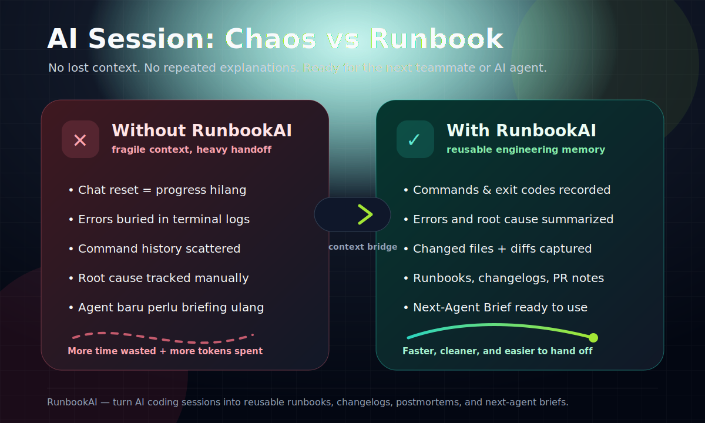

# RunbookAI

Turn your AI coding agent sessions into reusable runbooks, changelogs, and postmortems.

> **Don't worry about your AI agent's limit. RunbookAI has your back.**

RunbookAI is your **Context Insurance**. It records commands, changed files, errors, and technical decisions during debugging, then generates clean documentation so your progress never vanishes—even if your AI agent hits a token limit or you need to switch providers mid-session.

## The "Dreaded" Session Reset is Over

Ever hit a "message cap" mid-debugging? Switching from Claude to Cursor and having to explain everything again? 

RunbookAI acts as your **Universal Context Bridge**. Generate a `Next-Agent Brief` and give it to your next AI provider. They'll pick up exactly where you left off, saving you time, tokens, and sanity.

> Not session memory. Engineering memory.

## Why

AI coding tools like Claude Code, Cursor, Codex, Gemini CLI, OpenCode, pi, and Copilot can help fix bugs fast. But the useful process often stays trapped in chat/session logs:

- what commands were run,
- what errors appeared,
- what files changed,
- what failed,
- what root cause was found,
- how the fix was verified.

RunbookAI converts that process into repo-friendly Markdown documentation.

## Comparison: With RunbookAI vs Without RunbookAI



Media assets: [PNG](docs/assets/runbook-comparison.png) · [JPG](docs/assets/runbook-comparison.jpg) · [MP4](docs/assets/runbook-comparison.mp4)

| Area | Without RunbookAI | With RunbookAI |
| --- | --- | --- |
| Session continuity | Context is trapped in one chat and can be lost after reset, limit, or provider switch. | Work is captured as durable Markdown and can be handed to any future agent or teammate. |
| Command history | Commands must be remembered manually or searched from shell history. | Commands, exit codes, duration, and optional output are recorded during the session. |
| Error tracking | Errors are often buried in terminal/chat logs. | Detected errors are summarized and attached to the session documentation. |
| Changed files | File changes must be reconstructed from memory or Git diff. | Changed files and Git diff context are captured automatically with redaction. |
| Decisions and root cause | Technical reasoning may disappear when the chat ends. | Notes, decisions, findings, risks, and root cause are saved as reusable knowledge. |
| Handoff to another AI agent | You need to re-explain the problem, attempts, failures, and current state. | Generate a next-agent brief so another tool can continue from the exact state. |
| Team documentation | Postmortems, changelogs, and PR summaries are written manually after the fact. | Runbooks, changelogs, postmortems, and PR notes can be generated from the recorded session. |
| Token usage | Repeating context consumes more tokens across tools and sessions. | Reusable docs reduce repeated explanations and preserve context outside the chat window. |

## Status

Early Rust MVP — modular, tested, and lint-clean.

Implemented:

- Session lifecycle: `init`, `start`, `status`, `stop`
- Environment diagnostics: `doctor`
- Command capture: `exec "<command>"` and shell-hook based recording
- Manual notes: `note --type <kind> "..."`
- Documentation generation: `generate runbook`, `changelog`, `postmortem`, `pr`, `all`
- Session export: `export --format json|markdown`
- Session search: `search "<query>"`
- Shell helpers: `alias`, `shell-hook`
- MCP server: `mcp serve`
- Custom Handlebars templates (`.runbookai/templates/`)
- Enhanced Git diff capture with redaction
- Local `.runbookai/` storage
- Git changed-file detection
- Basic error detection
- Basic secret redaction
- 45 tests (29 unit + 16 integration)
- Zero clippy warnings

## Shell Integration (No More `exec`)

If you don't want to type `runbookai exec` for every command, you can integrate RunbookAI directly into your shell. This will automatically record every command you run whenever a session is active.

Add this to your `.zshrc`, `.bashrc`, or PowerShell profile:

```bash
# For Zsh
source <(runbookai shell-hook zsh)

# For Bash
source <(runbookai shell-hook bash)
```

```powershell
# For PowerShell
runbookai shell-hook powershell | Invoke-Expression
```

Now, simply running `runbookai start "title"` is enough. Every subsequent command in that shell will be recorded automatically until you run `runbookai stop`.

*Note: Zsh/Bash shell integration captures command strings, exit codes, and duration. PowerShell shell integration captures command strings and exit codes with duration set to `0`. For full output and error capture, `runbookai exec` is still recommended.*

## AI Provider Configuration

RunbookAI can generate AI-assisted summaries with:

```bash
runbookai generate runbook --ai
runbookai generate pr --ai
runbookai generate all --ai
```

Provider selection is environment-based:

- `OPENAI_API_KEY` → OpenAI, default model `gpt-4o`
- `GEMINI_API_KEY` → Gemini, default model `gemini-1.5-pro`
- no API key → local Ollama, default model `llama3`

Override the model with:

```bash
RUNBOOKAI_MODEL=llama3.1 runbookai generate runbook --ai
```

## MCP Server Support

RunbookAI supports the **Model Context Protocol (MCP)**. This allows AI agents (like Claude Desktop or Cursor) to directly query your previous sessions.

To use it with Claude Desktop, add this to your `claude_desktop_config.json`:

```json
{
  "mcpServers": {
    "runbookai": {
      "command": "runbookai",
      "args": ["mcp", "serve"]
    }
  }
}
```

Capabilities:
- **Tools:** `search_sessions` (search through old sessions).
- **Resources:** `runbook://sessions/<id>` (read full session data as JSON).

## Install from source

```bash
cargo install --path .
```

Or run directly:

```bash
cargo run -- --help
```

## Release builds

Tagged releases are built automatically for Linux, macOS, and Windows.

Create and push a version tag:

```bash
git tag v0.1.0
git push origin v0.1.0
```

GitHub Actions will publish archives for:

- `x86_64-unknown-linux-gnu`
- `x86_64-apple-darwin`
- `aarch64-apple-darwin`
- `x86_64-pc-windows-msvc`

## Windows build notes

On Windows, use one of these setups before running `cargo test` or `cargo clippy`:

- MSVC: install **Visual Studio Build Tools** with the **Desktop development with C++** workload, then run Cargo from a Developer PowerShell/Command Prompt.
- GNU: install MinGW binutils so `dlltool.exe` is available on `PATH`.

If Git Bash resolves `link.exe` to `C:\Program Files\Git\usr\bin\link.exe`, the MSVC linker is not being used.

## Quickstart

Initialize storage:

```bash
runbookai init
```

Start a session:

```bash
runbookai start "Fix login 401 error"
```

Run commands through RunbookAI:

```bash
runbookai exec "npm test"
runbookai exec "npm run build"
```

Add notes:

```bash
runbookai note --type root-cause "JWT secret was missing in test environment."
runbookai note --type decision "Validate env during app bootstrap."
runbookai note --type risk "Production env variables must not be renamed."
```

Check status:

```bash
runbookai status
```

Diagnose your local setup:

```bash
runbookai doctor
runbookai doctor --json
```

Stop recording:

```bash
runbookai stop
```

Generate docs:

```bash
runbookai generate all
```

Generated files are written to:

```txt
docs/runbooks/
```

Session data is stored locally in:

```txt
.runbookai/
```

## Project Structure

```
src/
  main.rs      # CLI entry point and command routing
  cli.rs       # Clap argument definitions
  models.rs    # Domain types (Session, CommandRecord, Note, etc.)
  config.rs    # Config loading
  doctor.rs    # Environment diagnostics
  session.rs   # Session lifecycle (init, start, stop, status, load, save)
  git.rs       # Git snapshot and diff parsing
  command.rs   # Command execution and note recording
  redact.rs    # Secret redaction
  detect.rs    # Error pattern detection
  render.rs    # Markdown generators (runbook, changelog, postmortem)
  export.rs    # JSON / Markdown export
  util.rs      # Shared helpers
```

## Example workflow

```bash
runbookai init
runbookai start "Fix auth test failure"
runbookai exec "npm test"
runbookai note --type finding "Login test fails with 401 for valid credentials."
runbookai note --type root-cause "JWT secret is missing in the test environment."
runbookai exec "npm run build"
runbookai stop
runbookai generate runbook
```

Example output:

```txt
docs/runbooks/2026-06-01-fix-auth-test-failure.md
```

The generated runbook includes:

- session summary,
- command history,
- detected errors,
- changed files,
- decisions,
- root cause,
- verification steps,
- failed attempts,
- next-agent brief.

## How it differs from `/resume` and memory tools

`/resume` and session history help continue a conversation inside one AI tool.

RunbookAI creates durable engineering artifacts that live in your repo and can be read by humans, teammates, and future agents.

## Relationship with ContextLint

- ContextLint = before AI session: audit and clean project context.
- RunbookAI = during/after AI session: preserve the fix process as reusable knowledge.

They are separate tools but can become part of a broader ContextOps workflow later.

## Product principle

If an AI agent helped fix it, the process should become reusable knowledge.
